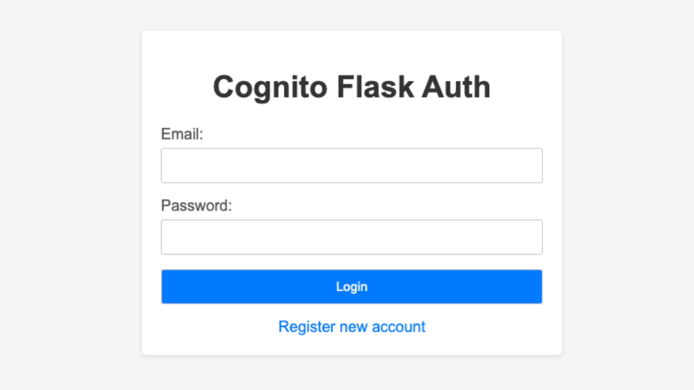

<h1>Cognito Flask Auth Demo</h1>

<h2>Table of Contents</h2>
<ul>
    <li><a href="#overview">Overview</a></li>
    <li><a href="#about-aws-cognito">About AWS Cognito</a></li>
    <li><a href="#instructions">Instructions</a>
        <ul>
            <li><a href="#setup-virtual-environment">Setup virtual environment</a></li>
            <li><a href="#export-aws-access-key-and-secret-key-to-environment-variables">Export AWS Access Key and Secret Key to environment variables</a></li>
            <li><a href="#create-the-cognito-pool-with-the-cognito-manager-script">Create the Cognito User Pool with the Stream Manager Script</a></li>
            <li><a href="#run-the-flask-app">Run the Flask App</a></li>
        </ul>
    </li>
    <li><a href="#pages">Pages</a>
        <ul>
            <li><a href="#login-page">Login Page</a></li>
            <li><a href="#registration-page">Registration Page</a></li>
            <li><a href="#logged-in-page">Logged In Page</a></li>
        </ul>
    </li>
    <li><a href="#cleanup">Cleanup</a>
        <ul>
            <li><a href="#delete-the-kinesis-data-stream-with-the-stream-manager-script">Delete the Kinesis Data Stream with the Stream Manager Script</a></li>
        </ul>
    </li>
</ul>

<h2>Overview:</h2>

This is a demo application created using Flask and Cognito to display a UI that manages user registration and authentication. There are rendered html pages and REST API endpoints that correspond to the registration, authentication, and authenticated user view.

<h2>About AWS Cognito:</h2>

AWS Cognito is a service that enables developers to add user sign-up, sign-in, and access control to their web and mobile applications quickly and securely. It supports user authentication, authorization, and user management, allowing integration with social identity providers and enterprise identity providers via SAML 2.0.

<h2>Instructions:</h2>

Getting the Data Stream up and running requires a few steps outlined below.

<h3 id="setup-virtual-environment">
Setup virtual environment
</h3>
<pre><code class="language-bash">
python3 -m venv venv;
pip install -r requirements.txt;
</code></pre>

<h3 id="export-aws-access-key-and-secret-key-to-environment-variables">
Export AWS Access Key and Secret Key to environment variables
</h3>
<pre><code class="language-bash">
export AWS_ACCESS_KEY_ID="{ACCESS_KEY_ID_STRING}";
export AWS_SECRET_ACCESS_KEY="{AWS_SECRET_ACCESS_KEY_STRING}";
</code></pre>

<h3 id="create-the-cognito-pool-with-the-cognito-manager-script">
Create the Cognito User Pool with the Cognito Pool Manager Script
</h3>

Note: The 'create' keyword after the script is needed. Creating this Data Stream will incur AWS charges

<pre><code class="language-bash">
python3 cognito_pool_manager.py create;
</code></pre>

<h3 id="run-the-flask-app">
Run the Flask App
</h3>
<pre><code class="language-bash">
python3 app.py;
</code></pre>

Once the Flask app is running, you should be able to access the webpage

<h2>Pages:</h2>
<h3 id="login-page">
Login Page:
</h3>

<h3 id="registration-page">
Registration Page
</h3>

<h3 id="logged-in-page">
Logged In Page
</h3>

    

<h2>Cleanup:</h2>

Once you are done with using the Cognito User Pool, you should delete the instance to stop incurring further charges.

<h3 id="delete-the-kinesis-data-stream-with-the-stream-manager-script">
Delete the Cognito User Pool with the Cognito Pool Script
</h3>

Note: The 'delete' keyword after the script is needed. The CloudFormation stack will be deleted as well as the Kinesis Stream defined by it.

<pre><code class="language-bash">
python3 cognito_pool_manager.py delete;
</code></pre>

